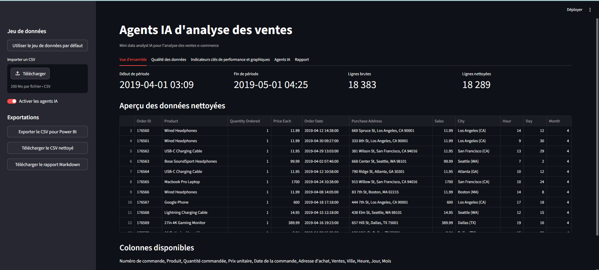
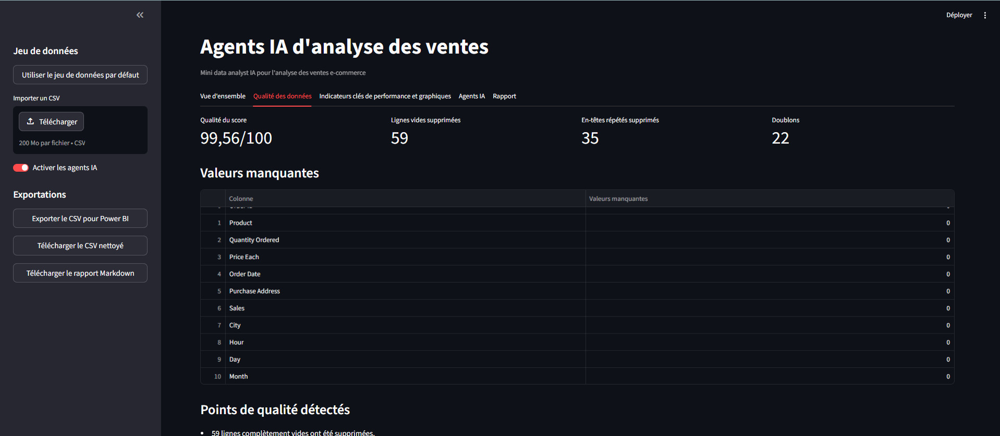
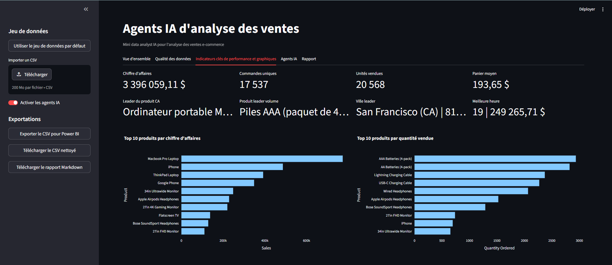
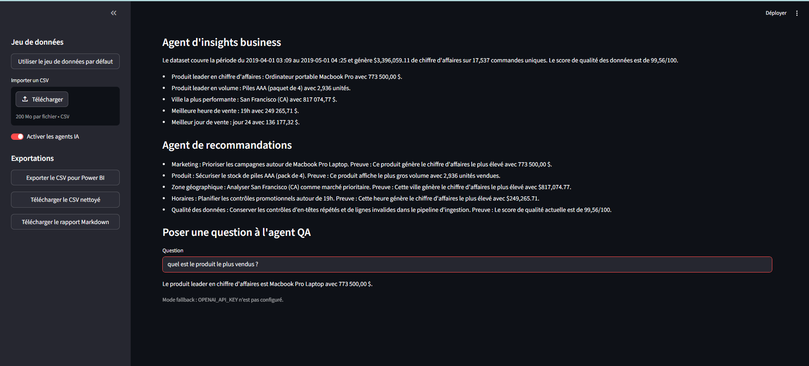
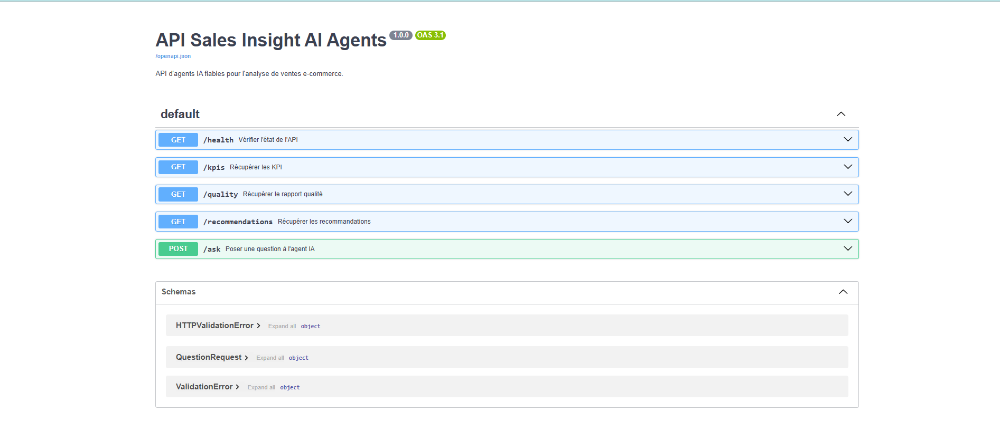
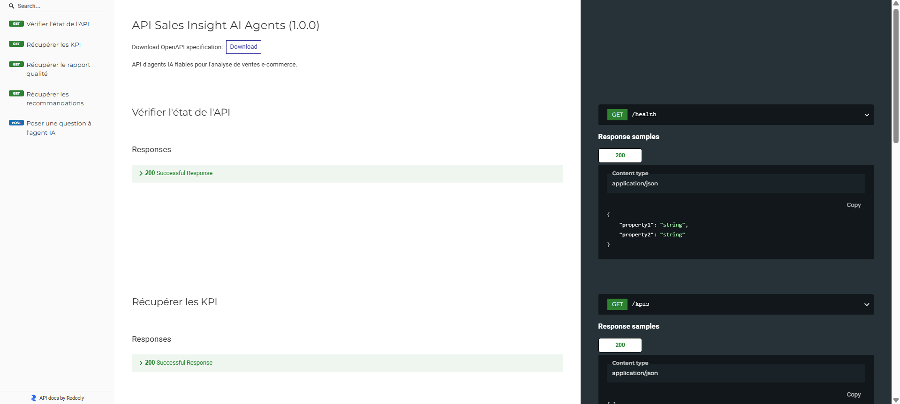
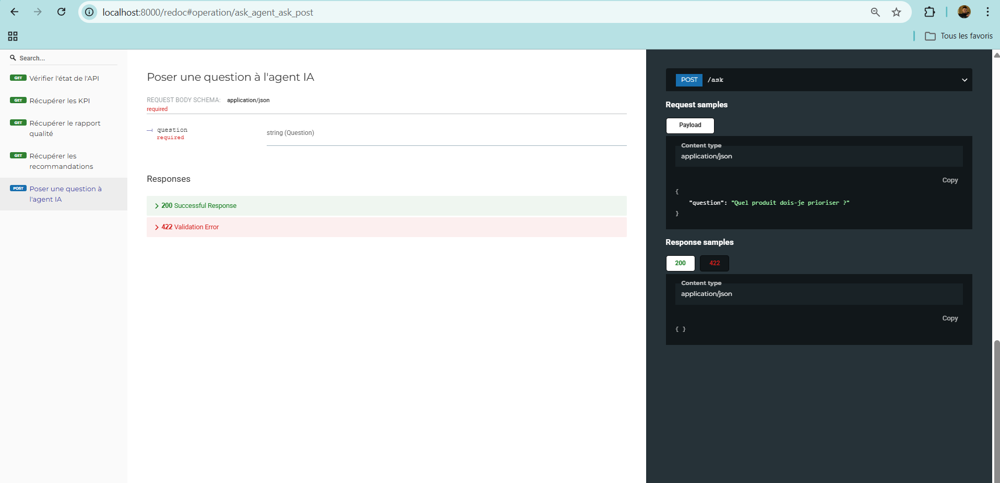

# Sales Insight AI Agents

Mini data analyst IA pour l'analyse de ventes e-commerce.

Ce projet transforme un fichier CSV de ventes brut en dataset nettoyé, KPI fiables, graphiques interactifs, audit de qualité, recommandations business, rapport Markdown, export compatible Power BI et réponses en langage naturel via des agents IA.

## Objectif

Construire un projet portfolio orienté Data Analyst, BI Engineer et IA appliquée.

Le principe central est volontairement strict : **le modèle IA ne calcule jamais les chiffres business**. Tous les KPI viennent du dataframe nettoyé avec Python et Pandas. Les agents IA servent à comprendre les questions, expliquer les résultats, formuler les recommandations et générer le rapport.

## Architecture

```txt
Utilisateur
  |
  v
Interface Streamlit / API FastAPI
  |
  v
OrchestratorAgent
  |
  +-- DataCleaningAgent       -> nettoyage Pandas
  +-- DataQualityAgent        -> score qualité et problèmes détectés
  +-- KPIAgent                -> KPI fiables
  +-- ChartAgent              -> données prêtes pour graphiques
  +-- BusinessInsightAgent    -> analyse business avec LLM
  +-- RecommendationAgent     -> recommandations avec LLM
  +-- ReportAgent             -> rapport Markdown
  +-- QAAgent                 -> questions-réponses en langage naturel
```

## Agents

| Agent | Rôle |
| --- | --- |
| `OrchestratorAgent` | Coordonne le workflow complet et transmet le contexte fiable aux agents. |
| `DataCleaningAgent` | Supprime les lignes vides, en-têtes répétés, lignes invalides et crée `Sales`, `City`, `Hour`, `Day`, `Month`. |
| `DataQualityAgent` | Calcule les indicateurs de qualité et un score entre 0 et 100. |
| `KPIAgent` | Calcule les KPI de ventes, commandes, produits, villes, heures et jours. |
| `ChartAgent` | Prépare les datasets nécessaires aux graphiques sans logique Streamlit. |
| `BusinessInsightAgent` | Utilise un LLM pour expliquer les KPI à partir du contexte fiable. |
| `RecommendationAgent` | Génère des recommandations business reliées aux KPI réels. |
| `ReportAgent` | Génère un rapport Markdown complet. |
| `QAAgent` | Répond aux questions sur les ventes, KPI, produits, villes, horaires, qualité et recommandations. |

## Stack technique

- Python 3.11+
- Streamlit
- FastAPI
- Pandas
- Plotly
- OpenAI API
- python-dotenv
- pytest
- Docker
- GitHub Actions

## Jeu de données

Le projet utilise le fichier :

```txt
data/Sales_April_2019.csv
```

Le CSV original à la racine du projet n'est pas supprimé.

## Fonctionnalités

- Chargement du dataset par défaut ou import CSV.
- Nettoyage robuste des lignes vides, en-têtes répétés, valeurs numériques invalides et dates invalides.
- Calcul des KPI à partir du dataframe nettoyé.
- Score qualité et explication des problèmes détectés.
- Graphiques interactifs Plotly.
- Insights business générés par agent IA à partir de métriques fiables.
- Recommandations reliées à de vrais KPI.
- Agent QA pour poser des questions en langage naturel.
- Génération d'un rapport Markdown.
- Export CSV propre pour Power BI.
- API FastAPI.
- Tests pytest.
- Docker.
- CI GitHub Actions.

## 📸 Aperçu de l'application

### Interface Streamlit








### API FastAPI




## Installation

Créer et activer un environnement virtuel :

```powershell
python -m venv .venv
.\.venv\Scripts\Activate.ps1
```

Installer les dépendances :

```powershell
pip install -r requirements.txt
```

Créer le fichier `.env` local :

```powershell
Copy-Item .env.example .env
```

Puis renseigner la clé API dans `.env` :

```txt
OPENAI_API_KEY=your_api_key_here
OPENAI_MODEL=gpt-4o-mini
LLM_PROVIDER=openai
ENABLE_AI_AGENTS=true
APP_ENV=development
```

Sans clé API, le pipeline analytique fonctionne quand même avec des réponses fallback déterministes.

## Lancer Streamlit

```powershell
streamlit run app/main.py
```

Alternative :

```powershell
python run_app.py
```

URL locale :

```txt
http://127.0.0.1:8501
```

## Lancer FastAPI

```powershell
uvicorn api.main:app --reload
```

Documentation Swagger :

```txt
http://127.0.0.1:8000/docs
```

## Endpoints API

| Méthode | Endpoint | Description |
| --- | --- | --- |
| `GET` | `/health` | Vérifie l'état de l'API. |
| `GET` | `/kpis` | Retourne les KPI fiables. |
| `GET` | `/quality` | Retourne le rapport qualité. |
| `GET` | `/recommendations` | Retourne les recommandations. |
| `POST` | `/ask` | Répond à une question analytique. |

Exemple :

```json
{
  "question": "Quel produit dois-je prioriser ?"
}
```

## Lancer les tests

```powershell
pytest
```

Les tests n'appellent pas l'API OpenAI.

## Docker

Construire l'image :

```powershell
docker build -t sales-insight-ai-agents .
```

Lancer le conteneur :

```powershell
docker run -p 8501:8501 --env-file .env sales-insight-ai-agents
```

## Export Power BI

L'application peut générer :

```txt
exports/clean_sales_for_powerbi.csv
```

Colonnes exportées :

- `Order ID`
- `Product`
- `Quantity Ordered`
- `Price Each`
- `Order Date`
- `Purchase Address`
- `Sales`
- `City`
- `Hour`
- `Day`
- `Month`

## Exemples de questions

- Quel produit génère le plus de chiffre d'affaires ?
- Quelle ville performe le mieux ?
- Quelle est la meilleure heure de vente ?
- Quel est le score qualité des données ?
- Quel produit dois-je prioriser en marketing ?
- Donne-moi un résumé global des ventes.

## Pourquoi ce projet est pertinent pour un profil Data / BI / IA

Ce projet montre une combinaison concrète de compétences :

- Data Analyst : nettoyage, KPI, analyse business.
- BI Engineer : export Power BI, préparation graphique, logique dashboard.
- Développeur Python : architecture modulaire, tests, API, Docker.
- IA appliquée : agents IA, réponses fondées sur données fiables, gestion de clé API.
- Engineering : CI, variables d'environnement, séparation entre outils analytiques et agents IA.

L'objectif est de montrer que l'IA peut augmenter un workflow analytique sans remplacer les calculs fiables.

## Roadmap

- Ajouter DuckDB pour les requêtes analytiques SQL.
- Ajouter LangGraph pour formaliser le workflow multi-agents.
- Ajouter une détection d'anomalies.
- Ajouter une segmentation produit ABC.
- Ajouter un export PDF du rapport.
- Ajouter des tests d'évaluation pour les réponses IA.

## Commandes GitHub

Initialiser le dépôt :

```powershell
git init
git add .
git commit -m "Initial Sales Insight AI Agents project"
```

Créer un repository GitHub, puis pousser :

```powershell
git branch -M main
git remote add origin https://github.com/WalidHALLOUCHE/sales-insight-ai-agents.git
git push -u origin main
```

Important : ne jamais pousser le fichier `.env`. Seul `.env.example` doit être versionné.
